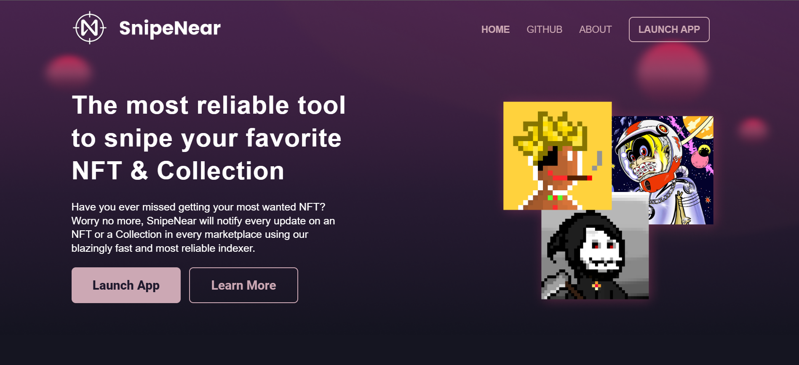

# SnipeNear

<div align="center"></div>

### SnipeNear

#### SnipeNear is the most reliable tool to snipe your favorite NFT & Collection.

Have you ever missed getting your most wanted NFT? Worry no more, SnipeNear will notify every update on an NFT or a Collection in every marketplace using our blazingly fast and most reliable indexer.

### Preview
<div align="center"></div>


### Usage

```
import React from "react";
import Button from "@material-tailwind/react/Button";

export default function Example() {
  return (
    <Button
      color="lightBlue"
      ripple="light"
    >
      Button
    </Button>
  )
}
```
### Social Media

Twitter: <a href="https://twitter.com/CreativeTim" target="_blank">https://twitter.com/CreativeTim</a>

Facebook: <a href="https://www.facebook.com/CreativeTim" target="_blank">https://www.facebook.com/CreativeTim</a>

Dribbble: <a href="https://dribbble.com/creativetim" target="_blank">https://dribbble.com/creativetim</a>

Instagram: <a href="https://www.instagram.com/creativetimofficial/" target="_blank">https://www.instagram.com/creativetimofficial/</a>
